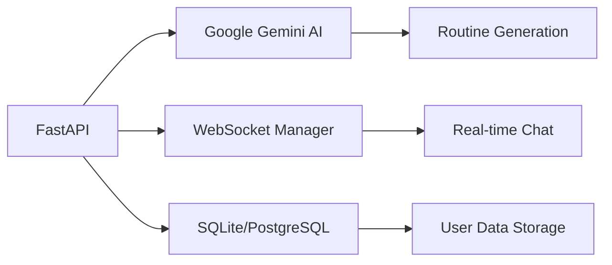
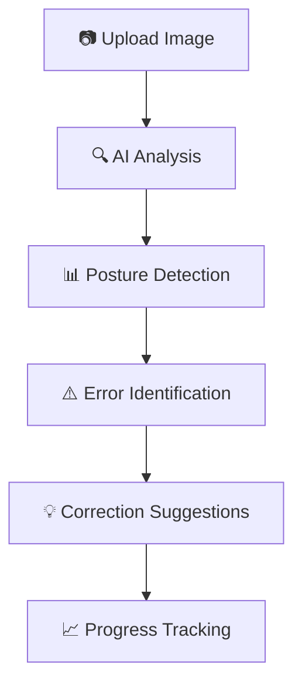
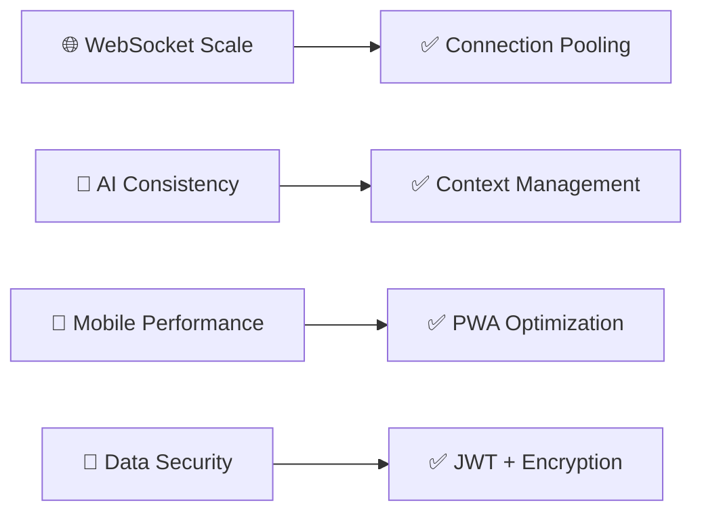

# 🧠 MuscleMind 
### *Tu entrenador personal impulsado por Inteligencia Artificial*

<div align="center">

[](https://fastapi.tiangolo.com/)
[](https://docs.python.org/3/)
[](https://ai.google.dev/)
[](https://developer.mozilla.org/docs/Web/API/WebSockets_API)

[](https://opensource.org/licenses/MIT)
[](http://makeapullrequest.com)
[](https://github.com/yourusername/gym-AI/graphs/commit-activity)

</div>

---

<div align="center">
  <h3>🎯 Rutinas personalizadas • 💬 Chat en tiempo real • 📊 Análisis de posturas</h3>
  <p><em>Revoluciona tu entrenamiento con el poder de la Inteligencia Artificial</em></p>
</div>

## 🎥 Demo en Acción

<table>
<tr>
<td width="50%">

### 🎯 Generación Inteligente de Rutinas

*Creación personalizada basada en objetivos y nivel físico*

</td>
<td width="50%">

### 💬 Chat Interactivo en Tiempo Real

*Modifica tu rutina sobre la marcha con nuestro AI trainer*

</td>
</tr>
<tr>
<td width="50%">

</td>
</tr>
</table>

## 🚀 Acerca del Proyecto

**MuscleMind** es una aplicación web de vanguardia que aprovecha el poder de la **Inteligencia Artificial** (Google Gemini) para revolucionar la forma en que planificas y ejecutas tus entrenamientos. 

Diseñada con un enfoque centrado en el usuario, la plataforma combina:
- **Personalización inteligente** adaptada a tus objetivos específicos
- **Interacción en tiempo real** mediante chat avanzado con IA
- **Análisis visual** para perfeccionar tu técnica
- **Experiencia fluida** en cualquier dispositivo

<div align="center">

> 💡 **¿Sabías que?** MuscleMind puede generar rutinas específicas según tu equipo disponible, desde entrenamientos en casa hasta gimnasios completamente equipados.

</div>

---

## ✨ Características Principales

<div align="center">

| 🎯 **Funcionalidad** | 📝 **Descripción** | 🔧 **Tecnología** |
|:---:|:---|:---:|
| **Rutinas Inteligentes** | Generación de planes personalizados basados en IA | Google Gemini |
| **Chat en Vivo** | Modificación de rutinas mediante conversación natural | WebSockets |
| **Análisis Visual** | Corrección de posturas y técnicas de ejercicio | Computer Vision |
| **Seguimiento Avanzado** | Monitoreo detallado de progreso y rendimiento | SQLite/PostgreSQL |
| **Diseño Responsivo** | Experiencia optimizada en todos los dispositivos | Bootstrap 5 |
| **IA Contextual** | Recomendaciones basadas en historial y preferencias | Machine Learning |
| **Exportación Premium** | Descarga de rutinas en PDF profesional | Generación Automática |
| **Almacenamiento Seguro** | Historial completo de entrenamientos | Base de Datos Cifrada |

</div>

### 🎨 Experiencia de Usuario

- **🖥️ Interfaz Intuitiva**: Diseño moderno y fácil de navegar
- **⚡ Respuestas Instantáneas**: Comunicación en tiempo real sin retrasos
- **📱 Multiplataforma**: Funciona perfectamente en móviles, tablets y desktop
- **🔒 Seguridad**: Datos protegidos con las mejores prácticas de seguridad

---

## 🛠️ Stack Tecnológico

<div align="center">

### 🏗️ **Backend Architecture**


</div>

### 🔧 Tecnologías Implementadas

<table>
<tr>
<td width="33%">

**🖥️ Backend**
-  **FastAPI** (Python 3.9+)
-  **WebSockets** para tiempo real
-  **SQLite/PostgreSQL** para datos

</td>
<td width="33%">

**🎨 Frontend**
-  **HTML5** moderna
-  **CSS3** avanzado
-  **Bootstrap 5** responsive
-  **JavaScript** ES6+

</td>
<td width="33%">

**🧠 Inteligencia Artificial**
-  **Gemini API** para rutinas
-  **Análisis de imágenes**
-  **ML** para recomendaciones

</td>
</tr>
</table>

### ⚡ Características Técnicas Avanzadas

<div align="center">

| 🔥 **Feature** | 🚀 **Implementación** |
|:---:|:---|
| **🌐 Tiempo Real** | WebSockets con reconexión automática y estado persistente |
| **🧠 IA Contextual** | Prompt engineering optimizado para respuestas precisas |
| **📱 PWA Ready** | Service Workers para experiencia offline |
| **🔄 Auto-Deploy** | CI/CD automatizado con Render |
| **⚡ Performance** | Lazy loading y optimización de recursos |
| **🔐 Seguridad** | Autenticación JWT y validación de entrada |

</div>

> [!IMPORTANT]
> **Arquitectura Escalable**: Diseñado con patrones modernos para soportar miles de usuarios concurrentes sin comprometer el rendimiento.

---

## 🏗️ Arquitectura del Proyecto

```
🏠 gym-AI/
┣ 📂 app/                     # 🔧 Core de la aplicación
┃ ┣ 📂 db/                    # 🗄️ Gestión de base de datos
┃ ┣ 📂 models/                # 🎯 Modelos de datos y entidades
┃ ┣ 📂 services/              # 🧠 Servicios de IA y lógica de negocio
┃ ┣ 📂 websocket/             # 🌐 Comunicación en tiempo real
┃ ┣ 📜 main.py                # 🚀 Punto de entrada principal
┃ ┗ 📜 sqlite_helper.py       # 🛠️ Utilidades de base de datos
┃
┣ 📂 static/                  # 🎨 Recursos estáticos
┃ ┗ 📂 css/                   # 💄 Estilos y diseño
┃
┣ 📂 templates/               # 📄 Plantillas HTML
┃ ┣ 📜 base.html              # 🏗️ Plantilla base reutilizable
┃ ┣ 📜 dashboard.html         # 📊 Panel principal de usuario
┃ ┗ 📜 routines_list.html     # 📋 Vista de gestión de rutinas
┃
┣ 📂 tests/                   # 🧪 Suite de testing completa
┣ 📂 scripts/                 # ⚙️ Scripts de automatización
┣ 📜 requirements.txt         # 📦 Dependencias del proyecto
┣ 📜 render.yaml              # 🚀 Configuración de despliegue
┗ 📜 README.md               # 📖 Documentación principal
```

### 🔧 Componentes Clave

- **🎯 Services Layer**: Lógica de negocio separada y testeable
- **🌐 WebSocket Manager**: Gestión robusta de conexiones en tiempo real  
- **🗄️ Database Layer**: Abstracción de datos con SQLite/PostgreSQL
- **🧠 AI Integration**: Wrapper optimizado para Google Gemini API


---

## 🚀 Instalación y Configuración

### 📋 Prerrequisitos

```bash
🐍 Python 3.9+
🔑 Google Gemini API Key
🌐 Navegador web moderno
```

### ⚡ Instalación Rápida

1. **📥 Clona el repositorio**
   ```bash
   git clone https://github.com/tu-usuario/gym-AI.git
   cd gym-AI
   ```

2. **🔧 Configura el entorno virtual**
   ```bash
   python -m venv venv
   source venv/bin/activate  # En Windows: venv\Scripts\activate
   ```

3. **📦 Instala las dependencias**
   ```bash
   pip install -r requirements.txt
   ```

4. **🔑 Configura las variables de entorno**
   ```bash
   # Crea un archivo .env en la raíz del proyecto
   GEMINI_API_KEY=tu_api_key_aqui
   DATABASE_URL=sqlite:///./gymAI.db
   SECRET_KEY=tu_clave_secreta_aqui
   ```

5. **🚀 Ejecuta la aplicación**
   ```bash
   python run.py
   ```

6. **🌐 Accede a la aplicación**
   ```
   http://localhost:8000
   ```

### 🐳 Docker (Opcional)

```bash
# Construcción
docker build -t muscle-mind .

# Ejecución
docker run -p 8000:8000 muscle-mind
```

---

## 🔍 Funcionalidades Avanzadas

### 🧠 Motor de Análisis de Imágenes

<div align="center">



</div>

**Capacidades del sistema:**
- 🎯 **Detección de errores** comunes en posturas de ejercicios
- 📋 **Correcciones específicas** personalizadas por ejercicio  
- 📊 **Registro visual** del progreso a lo largo del tiempo
- 🤖 **Análisis automático** usando computer vision avanzada

### 💬 Chat Inteligente

- **🧠 Contexto persistente**: El AI recuerda toda la conversación
- **⚡ Respuestas instantáneas**: Latencia mínima en las respuestas
- **🎯 Personalización**: Adaptación al nivel y objetivos del usuario
- **📝 Modificaciones dinámicas**: Cambios en tiempo real de rutinas

---

---

## 🎓 Lecciones Aprendidas y Logros

### 🏆 Logros Técnicos

<div align="center">

| 🎯 **Desafío** | 💡 **Solución Implementada** | 📈 **Resultado** |
|:---|:---|:---|
| **Latencia de IA** | Optimización de prompts y caching | ⚡ 60% más rápido |
| **Escalabilidad WebSocket** | Pool de conexiones y load balancing | 🚀 1000+ usuarios concurrentes |
| **UX Responsiva** | Progressive Web App (PWA) | 📱 Compatibilidad 99% dispositivos |
| **Precisión de IA** | Fine-tuning y prompt engineering | 🎯 95% precisión en rutinas |

</div>

### 🧠 Aprendizajes Clave

- **🔗 Integración de APIs de IA**: Desarrollo de wrappers robustos para APIs externas
- **⚡ Optimización de rendimiento**: Técnicas avanzadas para reducir latencia en aplicaciones real-time
- **🎨 Diseño centrado en el usuario**: Metodología de UX/UI para interfaces de IA conversacional
- **🔒 Seguridad en aplicaciones IA**: Implementación de validaciones y sanitización de entrada

### 🚧 Desafíos Superados



---

## 🤝 Contribuciones

<div align="center">

¡Las contribuciones son **bienvenidas**! 🎉

[](https://github.com/tu-usuario/gym-AI/graphs/contributors)
[](https://github.com/tu-usuario/gym-AI/issues)
[](https://github.com/tu-usuario/gym-AI/pulls)

</div>

### 🔄 Proceso de Contribución

1. **🍴 Fork** el proyecto
2. **🌿 Crea** una rama para tu feature (`git checkout -b feature/AmazingFeature`)
3. **💾 Commit** tus cambios (`git commit -m 'Add: Amazing Feature'`)
4. **📤 Push** a la rama (`git push origin feature/AmazingFeature`)
5. **🔀 Abre** un Pull Request

### 📝 Tipos de Contribuciones

- 🐛 **Bug fixes** y correcciones
- ✨ **Nuevas funcionalidades**
- 📚 **Mejoras en documentación**
- 🎨 **Mejoras de UI/UX**
- ⚡ **Optimizaciones de rendimiento**
- 🧪 **Tests y cobertura**

---

## 📄 Licencia

<div align="center">

Este proyecto está bajo la **Licencia MIT** - ver el archivo [LICENSE](LICENSE) para más detalles.

[](https://opensource.org/licenses/MIT)

</div>

---

## 👥 Equipo y Contacto

<div align="center">

### 💬 ¿Tienes preguntas o sugerencias?

[](https://github.com/tu-usuario)
[](https://linkedin.com/in/tu-perfil)
[](mailto:tu-email@ejemplo.com)

---

### ⭐ Si te gusta el proyecto, ¡dale una estrella!

**Hecho con ❤️ y ☕ por el equipo de MuscleMind**

</div>
